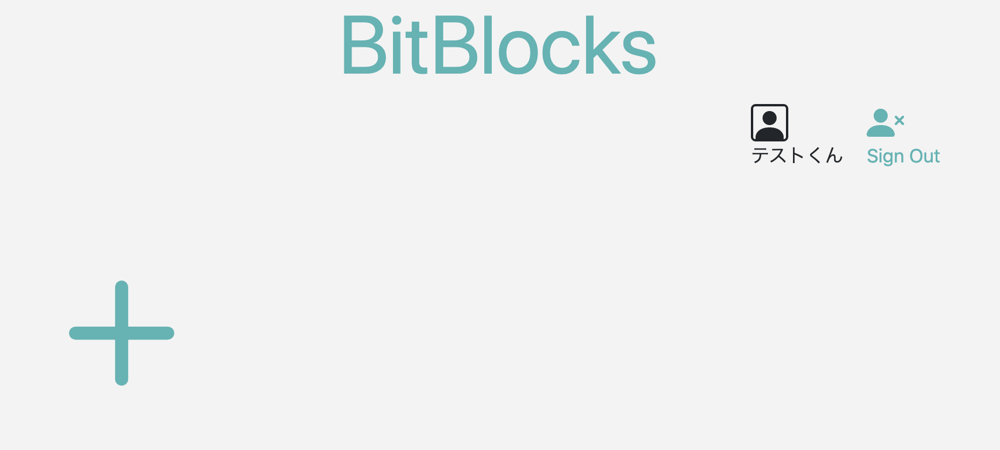
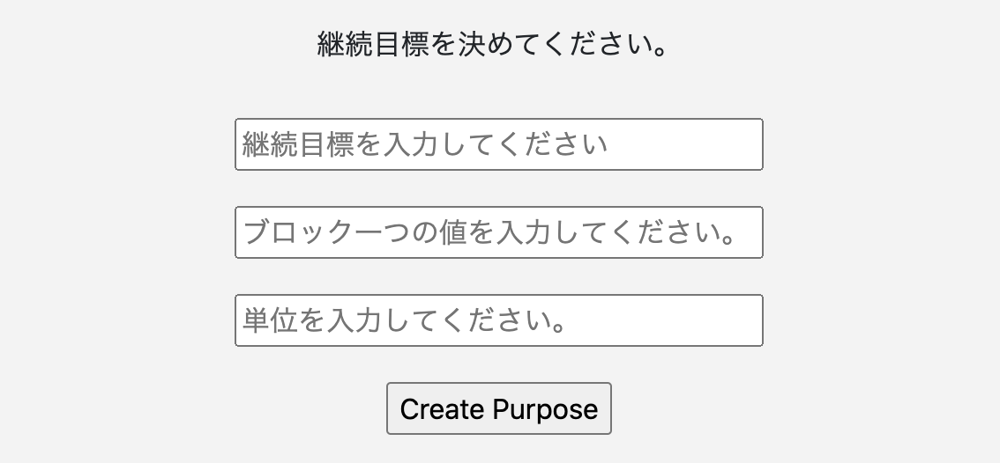
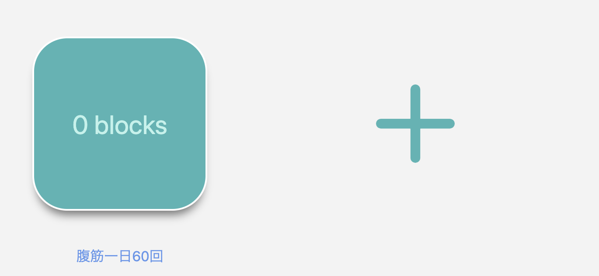
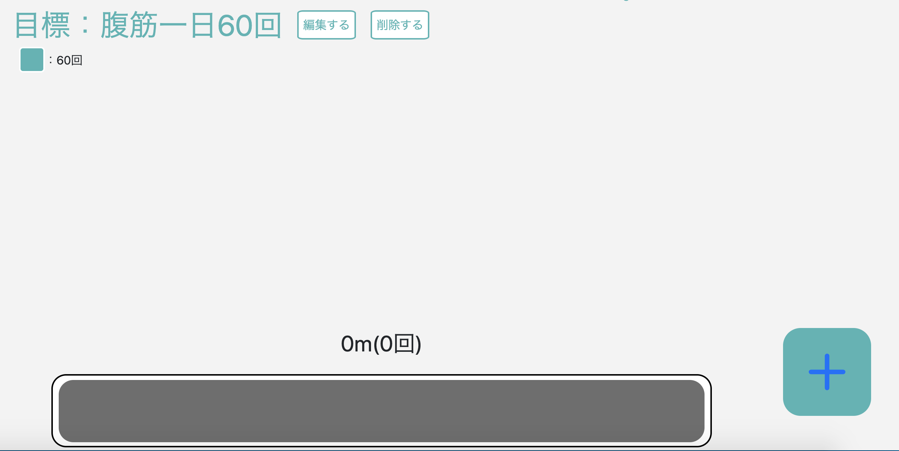
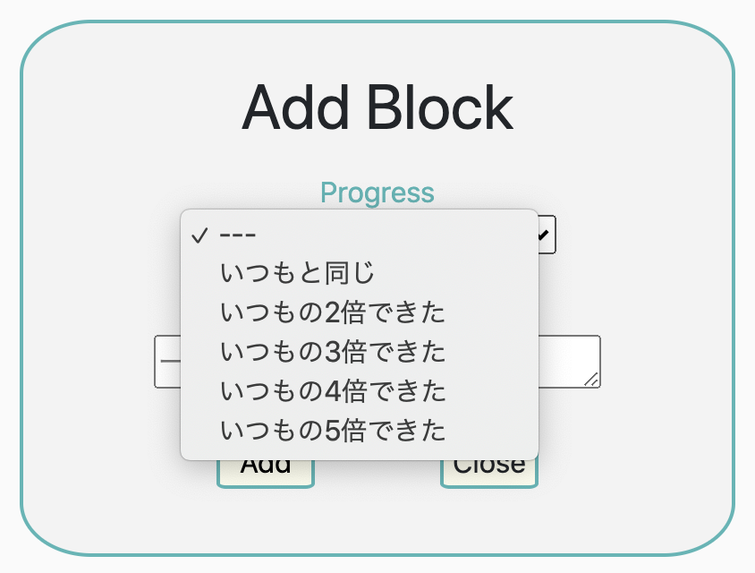
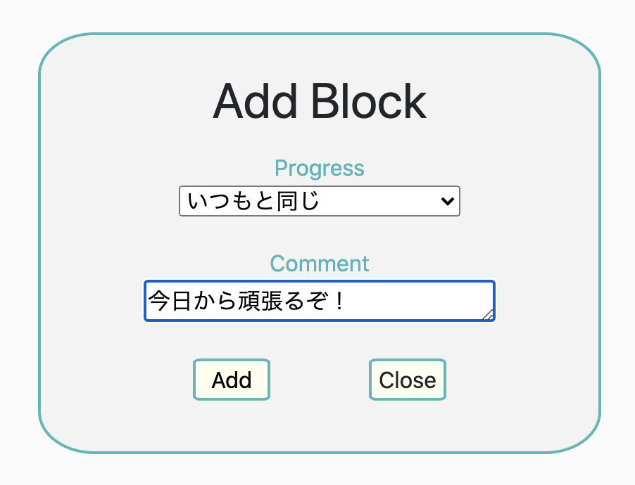
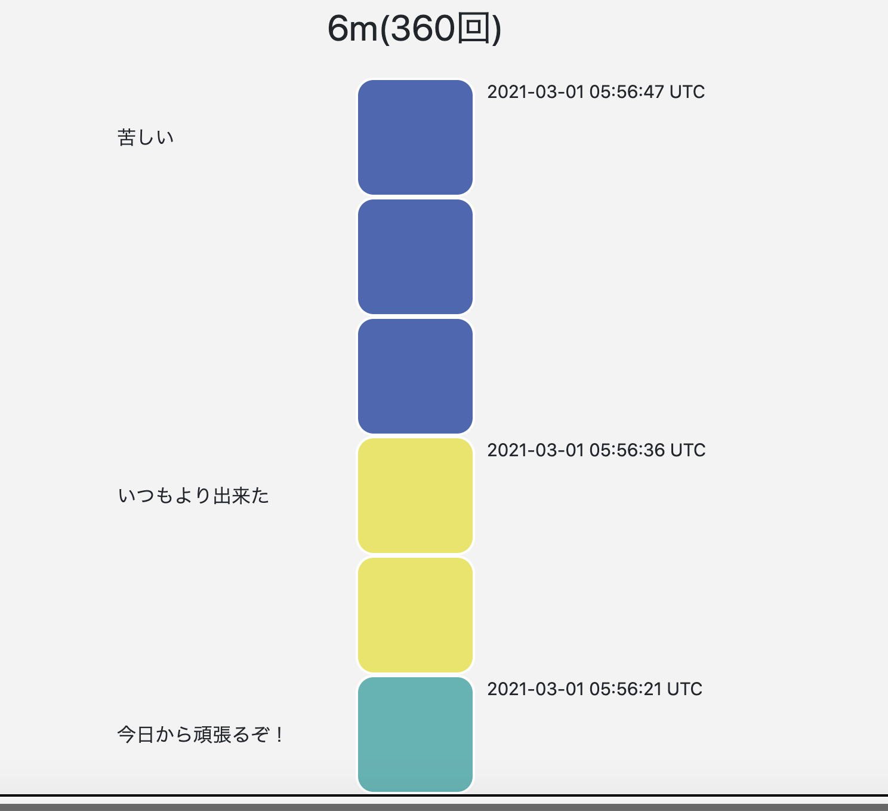

# アプリケーション名
BitBlocks

# アプリケーション概要
習慣的に続けたい物事のモチベーション維持をサポートする事です。
自分自身がどれくらい続けているかを可視化する事で、モチベーション維持に繋げていただけます。

# URL
https://bit-blocks.herokuapp.com/

# テスト用アカウント
email : test@test.com
パスワード ：112233

basic認証
ID : admin
PASS : 2222

# 利用方法
## 継続目標の設定
トップページ右上のSign Inボタンからサインイン後、
次のページで大きい「 + 」のアイコンをクリックすると、「継続目標」を決める画面に変わります。
.png)

そこで継続目標と「ブロック一個に相当する具体的な数値」と「その数値の単位」を決めていただきます。
（例: 「腹筋一日６０回」という目標すると、「ブロック一個に相当する具体的な数値」に「６０」、
「単位」に「回」と入れてください。）

## ブロックの積み上げ
上記で目標を設定するとトップページに遷移します。
目標をクリックします。

目標の詳細ページでは実際に進捗の入力としてブロックを積み上げます。

右下の＋ボタンをクリックすると入力のポップアップが表示され、

Progressに目標の何倍達成したか、を選択します。
下の入力欄にはコメントを入力できます。（必須ではありません。）

ユーザーは継続目標に取り組む度にここに入力していくと、その分ブロックが積み上がり、それによって自分の積み上げた取り組みが可視化され、モチベーデョン維持に繋がると考えています。

# 目指した課題解決
ことわざで「塵も積もれば山と成る」とあるように、何事においても毎日の「コツコツ」がずっと続けば、
後々そのコツコツが大きな物になります。
しかし、その「コツコツ」を継続するのはモチベーション維持が大変だと思います。
このアプリケーションではその取り組みを、塵ではなくブロックがどんどん積み上がる様子で可視化し、モチベーションを維持を目指しています。

# 実装した機能についてのGIFと説明
## 機能
| 機能                  | 目的	               | 詳細	                                | ストーリー(ユースケース)                                |
| --------------------- | -------------------- | ------------------------------------ | -----------------------------------------------------   |
|トップページ           | 目標を一覧表示       | 目標の再確認                         | 継続目標は四角で表示し、クリックすると詳細へ            |
|継続目標を決めるページ | 目標設定             | 内容とブロックに対応する数値を決める | formのplacaholderの内容を入力する                       |
|ブロックを追加する機能 | シンプルなボタン     | 直感的でわかりやすいデザイン         | +のボタンをクリックするとポップアップが出る             |
|ユーザー登録           | ユーザー毎で目標設定 | 自分の目標だけわかるように           | ヘッダーにSignUp/SignIn、サインアウト事はSignOutのボタン|

# 実装予定の機能
アニメーションを追加したい

# ローカルでの動作方法
git clone https://github.com/Bakiyama/bit-blocks.git
rubyのバージョン:ruby 2.6.5p114 
railsのバージョン：Rails 6.0.3.4

# テーブル設計

## users テーブル

| Column             | Type     | Options                   |
| ------------------ | -------- | ------------------------- |
| email              | string   | null: false, unique: true |
| encrypted_password | string   | null: false               |
| nickname           | string   | null: false               |

### Association
- has_many :purposes
- has_many :blocks

## purposes テーブル

| Column   | Type       | Options           |
| -------- | ---------- | ----------------- |
| name     | string     | null: false       |
| unit     | integer    | null: false       |
| user     | references | foreign_key: true |

### Association
- belongs_to :user
- has_many :blocks

## blocks テーブル

| Column    | Type       | Options           |
| --------  | ---------- | ----------------- |
| value_id  | integer    | null: false       |
| comment   | text       | null: false       |
| user      | references | foreign_key: true |
| purpose   | references | foreign_key: true |

### Association
- belongs_to :user
- belongs_to :purpose